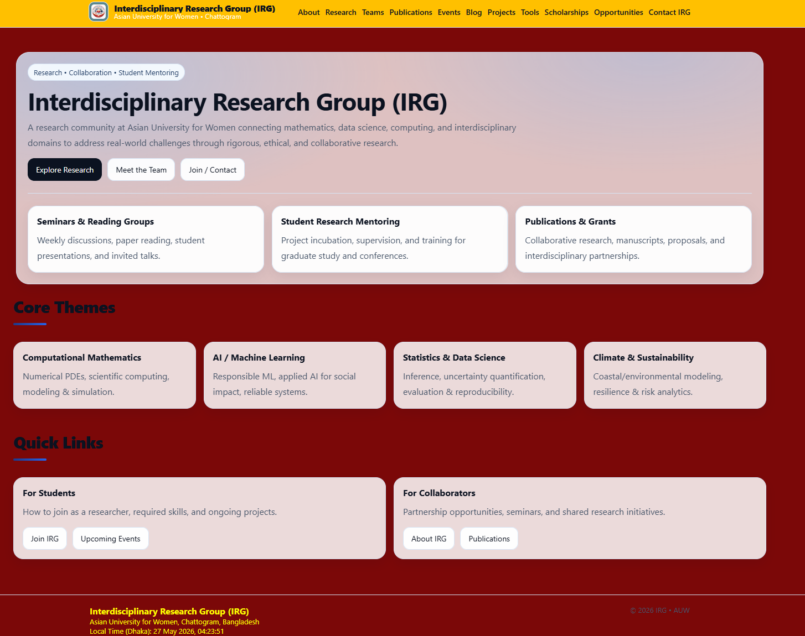
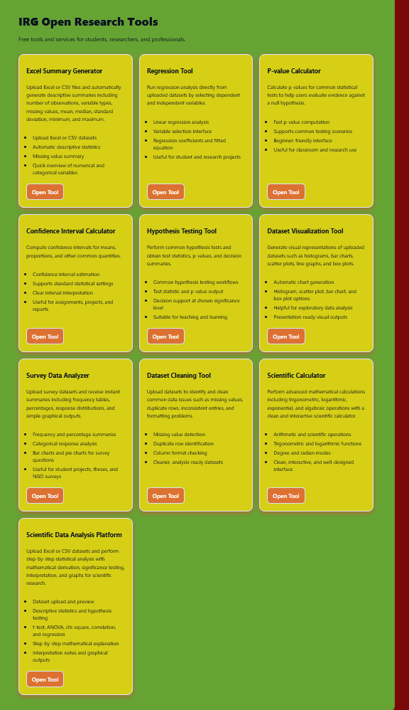

# Interdisciplinary Research Group (IRG) Academic Platform

<p align="center">
  <b>Official Academic and Research Platform of the Interdisciplinary Research Group (IRG)</b><br>
  Asian University for Women (AUW), Chattogram, Bangladesh
</p>

<p align="center">
  <a href="https://irg-website.vercel.app/">
    
  </a>
  <a href="https://github.com/Mamunurrasid123/irg-website">
    
  </a>
</p>

<p align="center">
  
  
  
  
</p>

---

# Overview

The **Interdisciplinary Research Group (IRG) Academic Platform** is a modern academic and research-oriented web platform developed for the **Interdisciplinary Research Group (IRG)** at **Asian University for Women (AUW)**.

The platform is designed to support:

- interdisciplinary academic collaboration
- research visibility and communication
- digital educational tools
- faculty and student engagement
- academic outreach and institutional development

The website integrates research presentation, educational analytics, academic resources, and interactive tools within a unified modern web environment.

---

# Live Platform

## Website
https://irg-website.vercel.app/

## GitHub Repository
https://github.com/Mamunurrasid123/irg-website

---

# Website Preview

## Desktop Academic Interface



---

## Research & Educational Tools



---
<!-- ## Mobile Responsive Design

 -->

---

# About IRG

The **Interdisciplinary Research Group (IRG)** is an academic initiative established at AUW to promote collaborative research and interdisciplinary academic development across diverse fields including:

- Mathematics
- Data Science
- Artificial Intelligence
- Computational Science
- Statistics
- Public Health
- Environmental Science
- Biological Science
- Applied Research Areas

The platform acts as a centralized digital academic ecosystem for research collaboration, communication, educational innovation, and interdisciplinary engagement.

---

# Objectives of the Platform

The platform aims to:

- Promote interdisciplinary academic research
- Enhance student research engagement
- Increase visibility of AUW-based research initiatives
- Support digital learning and educational analytics
- Encourage faculty-student collaboration
- Provide interactive academic and statistical tools
- Foster international academic networking
- Develop sustainable academic digital infrastructure

---

# Core Website Features

## Academic Pages

The platform includes multiple academic and institutional sections:

- Home Page
- About IRG
- Research Areas
- Faculty & Member Profiles
- Research Projects
- Opportunities & Scholarships
- Academic Blog & News
- Contact & Communication

---

## Interactive Academic & Research Tools

The website integrates educational and analytical tools including:

- Excel Summary Generator
- Regression Analysis Tool
- P-value Calculator
- Probability Distribution Tools
- Dataset Cleaning Tool
- Data Visualization & Chart Generator
- Statistical Analysis Utilities
- Spreadsheet-based Academic Tools
- Interactive Educational Modules

---

## Additional Functionalities

- Fully responsive academic interface
- Mobile-friendly design
- Dynamic faculty and researcher profile system
- Structured academic blog architecture
- Scholarship and academic opportunity pages
- Bangladesh local date and time integration
- Modular scalable architecture
- Clean academic navigation and UI structure

---

# Technology Stack

## Frontend Development

- Next.js
- React
- TypeScript

---

## Data Analysis & Visualization

- Chart.js
- React-Chartjs-2
- PapaParse
- ExcelJS

---

## Export & Utility Libraries

- jsPDF
- html2canvas

---

## Styling & User Interface

- CSS
- Responsive Design
- Custom UI Components
- Academic Layout Architecture

---

## Deployment & Version Control

- GitHub
- Vercel

---

# Key Contributions

This platform was independently designed and developed as part of IRG’s academic digital infrastructure initiative.

### Major Contributions

- Designed and developed the complete IRG academic platform
- Implemented responsive academic UI/UX architecture
- Developed integrated educational and statistical tools
- Structured research and collaboration management pages
- Integrated dynamic academic content systems
- Managed deployment and version control using GitHub and Vercel
- Designed scalable architecture for future institutional expansion

---

# Academic Impact

The IRG Academic Platform contributes to:

- strengthening interdisciplinary research collaboration
- supporting student-centered research engagement
- improving accessibility to educational analytical tools
- enhancing AUW’s digital academic infrastructure
- promoting international visibility of AUW-based initiatives
- encouraging technology-driven academic development

---

# Project Structure

```bash
irg-website/
│
├── app/
│   ├── about/
│   ├── contact/
│   ├── members/
│   ├── opportunities/
│   ├── projects/
│   ├── research/
│   ├── blog/
│   ├── scholarships/
│   ├── tools/
│   ├── layout.tsx
│   └── page.tsx
│
├── components/
│   ├── Navbar.tsx
│   ├── Footer.tsx
│   ├── Hero.tsx
│   └── SharedUIComponents.tsx
│
├── public/
│   ├── images/
│   ├── logos/
│   └── icons/
│
├── data/
│   ├── members.ts
│   ├── projects.ts
│   └── blogs.ts
│
├── styles/
│   └── globals.css
│
├── package.json
├── tsconfig.json
└── README.md
```

---

# Installation & Setup

## Clone the Repository

```bash
git clone https://github.com/Mamunurrasid123/irg-website.git
cd irg-website
```

---

## Install Dependencies

```bash
npm install
```

or

```bash
yarn install
```

---

## Run Development Server

```bash
npm run dev
```

Open the application in your browser:

```bash
http://localhost:3000
```

---

# Production Deployment

## Build for Production

```bash
npm run build
npm start
```

---

# Deployment on Vercel

1. Push the repository to GitHub
2. Import the project into Vercel
3. Configure build settings if necessary
4. Deploy

---

# Customization

The platform can be customized by updating:

- IRG branding and institutional information
- Faculty and member profiles
- Research areas and projects
- Academic blog posts
- Educational tools and utilities
- Color themes and layouts
- Institutional images and logos

---

# Target Users

The platform is intended for:

- University students
- Faculty members
- Researchers
- Academic collaborators
- Research groups
- Prospective students
- International academic partners

---

# Future Development

Planned future improvements include:

- Research publication archive
- Seminar and event management system
- Student research showcase
- Faculty collaboration portal
- AI-assisted educational analytics
- Automated statistical reporting
- Machine learning educational modules
- Database-backed content management
- Research recommendation systems
- Interactive academic dashboards

---

# Project Lead & Developer

## Dr. Md. Mamunur Rasid

Assistant Professor of Mathematics & Data Science  
Director of Mathematics, Pathways & Foundation Program  
Asian University for Women (AUW)  
Chattogram, Bangladesh

### Academic & Technical Areas

- Computational Mathematics
- Numerical Analysis
- Data Science & AI
- Scientific Computing
- Educational Technology
- Research Platform Development

---

# Institutional Affiliation

## Interdisciplinary Research Group (IRG)

Asian University for Women (AUW)  
Chattogram, Bangladesh

---

# License

This project is intended for academic and educational purposes.

All rights reserved by IRG.

---

# Acknowledgements

- Asian University for Women (AUW)
- IRG faculty collaborators
- Student contributors and researchers
- Open-source development communities
- Academic collaborators and interdisciplinary research partners